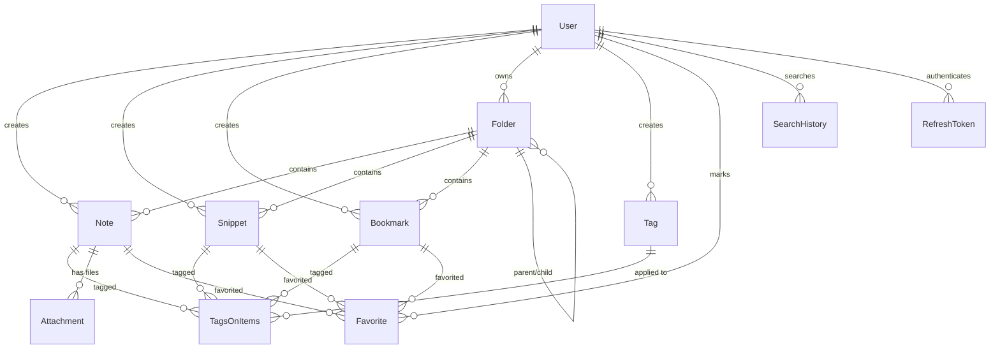

# DevSearch — Database Schema

## Entity Relationship Diagram

## Key Design Decisions

1. **UUIDs as primary keys** — Avoids sequential ID guessing, works well in distributed systems
2. **Polymorphic tagging** — `TagsOnItems` join table links tags to notes, snippets, OR bookmarks via nullable foreign keys
3. **Polymorphic favorites** — Same pattern as tags, one table handles favorites for all content types
4. **Folder tree** — Self-referencing `parentId` enables nested folder hierarchy
5. **Refresh token storage** — Stored in DB to enable revocation and rotation
6. **Search history** — Tracks queries with optional "saved" flag for quick re-access
